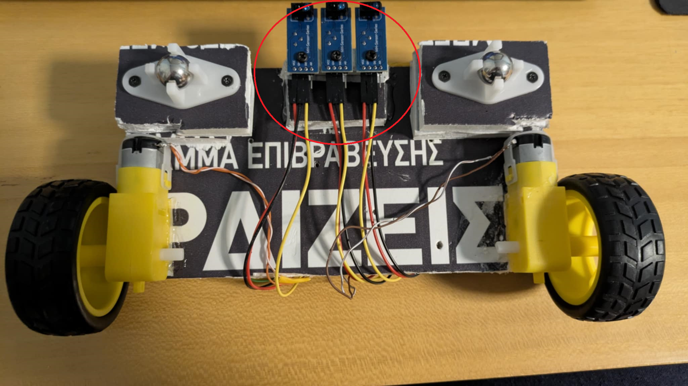
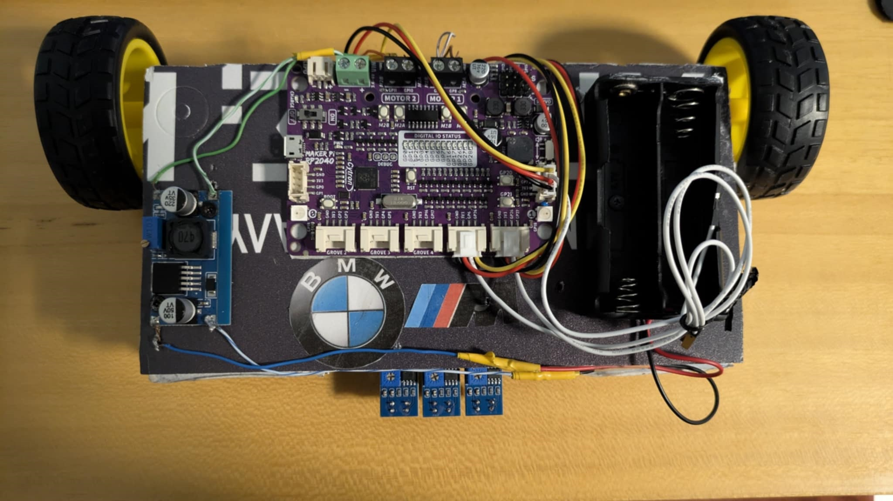
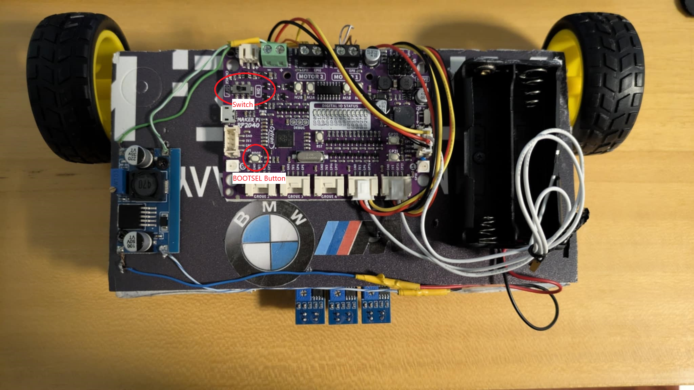

# Line Follower Robot Project  
*Embedded Systems Class - Computer Science (DUTh)*

---

## Materials Needed

To recreate this project, you will need:

1. **Cytron Technologies Maker Pi RP2040**  
2. **2 DC Motors** (ours are 120RPM, but you can use motors with higher RPM)  
3. **3 TCRT5000 IR Sensors** or any equivalent  
4. **2 x 18650 Batteries**  
5. **1 x 2-slot 18650 Battery Holder**  
6. **A Step-Down Voltage Regulator** (buck converter)  
7. **2 Rubber Wheels**  
8. **2 Ball Caster Wheels**  
9. **Time and Patience!**

---

## Assembly Instructions
### Step 0: Solder the components
To start, find some wires and solder the following:
  -  The step-down voltage regulator inputs with the battery pack.
  -  The step-down voltage regulator outputs with excess wires, so we can power the board.
  -  Both pins of the motors.
Soldering ensures that the connections are secure and there is not going to be any unexpected disconnection of the cables.

### Step 1: Prepare the Chassis  
Find a **20cm x 10cm** piece of plastic or hard cardboard for your chassis (a shorter length, e.g. 15cm, will also work).

---

### Step 2: Attach the Motors  
Glue the motors on the sides of the long edge of the chassis to ensure the best traction.

---

### Step 3: Mount the IR Sensors  
Build a small base to hold the IR sensors side-by-side, preferably with at least a **1cm gap** between each sensor to cover more ground (the example is not 1cm).

---

### Step 4: Attach IR Sensors Under Chassis  
Attach the IR sensor base under the chassis, preferably close to the center.

---

### Step 5: Add Ball Caster Wheels  
Attach 2 ball caster wheels, one on each side. You might need standoffs to keep them clear of the ground.

---

### Step 6: Place Battery Pack, Board, and Regulator  
Arrange the 18650 battery pack, Maker Pi RP2040 board, and step-down voltage regulator on top of the chassis as you see fit.

---

### Step 7: Connect IR Sensors to Board  
Use the Grove cables provided with the Maker Pi RP2040 (or separate cables if preferred) to connect the IR sensors to the board digital pins.

---

### Step 8: Connect Motors to Motor Driver  
Connect each motor to its corresponding motor driver clamp.  
- Check that **M1B** and **M2B** LEDs light up when you turn the motors counter-clockwise  
- **M1A** and **M2A** LEDs light up when turning clockwise  
- If LEDs are reversed, swap M1A and M1B (same for M2) and adjust your code accordingly.

---

### Step 9: Install MicroPython and Upload Code  
- Connect your board to the PC via USB while holding the **BOOTSEL** button  
- Flip the power switch to ON  
- Open **Thonny IDE** and install MicroPython on your board  
- Copy the provided code from the repository  
- Save it on the board as `main.py`

---

### Step 10: Power and Test Your Robot  
- Flip the power switch to OFF  
- Disconnect USB and connect the batteries to the battery holder  
- Place your robot on the track and switch power ON to start the program  

Congratulations! You’ve created a **line follower robot**!

This project was created by:
  - Nick Chaitas
  - Zois Alexandridis
  - Pavlos Amanatidis
  - Alkiviadis Ballas
